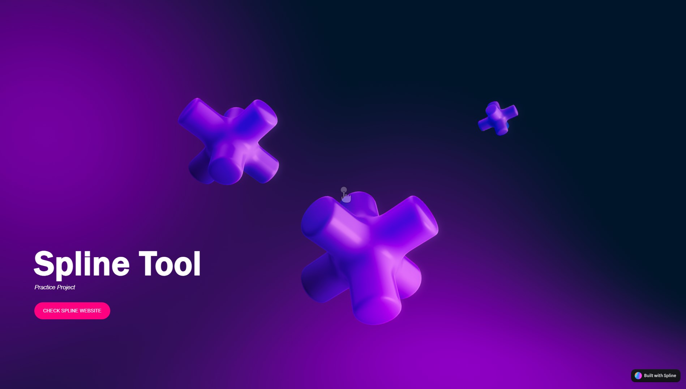

# Interactive 3D Landing Page Prototype

## General Info
3D, interactive and animated Landing Page maquette built with Spline tool. 
## Features
* Interactivity: actions on hover, animations, changing view perspective by clicking and mousemoving;
* Visual effects: spacious 3D background with gradient colors, ambient light with soft shadows, spring-type movement gives a feeling of dynamic space;
* Responsiveness provided by the tool output;
* No dependencies required;
* Call-to-action button which takes us to the Spline tool webpage.
* Simple design implementation by a short code snippet gives a chance for reusing the background project.
## Technologies
Build with:
- HTML
- CSS
- Spline tool
## Considerations
* Used simple iframe tag which, I assume, gives less options for cumstomizing
* Spline tool may cause performane issues.
* For full responsiveness, the project should contain queries with different iframe setups for each group of screen dimmensions
* The design doesn't include all the proper landing page elements since getting familiar with the Spline tool was the goal
## Inspirations & Resources
* [Spline tool webpage](https://spline.design/#features)
